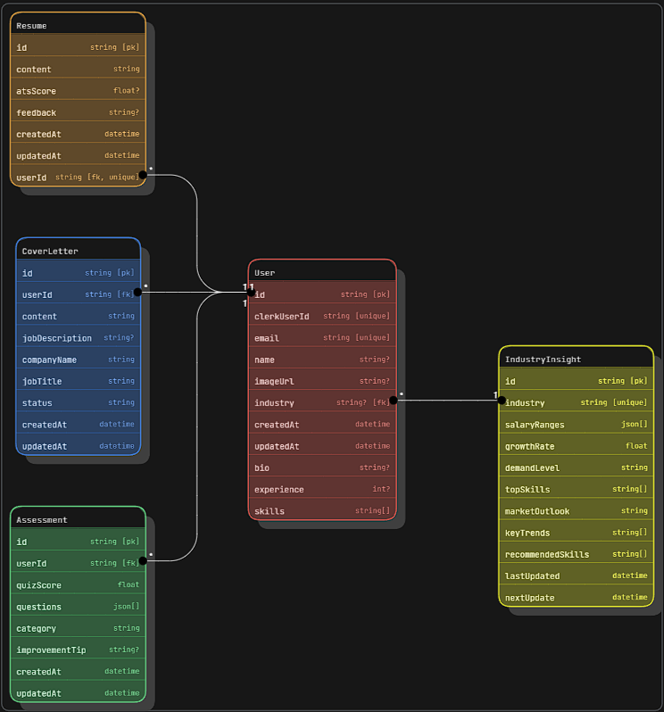

# 🚀 ElevateAI – AI-Powered Career Coach


&#x20;      &#x20;

> **Full Stack AI Career Assistant built with React 19 + Next.js 15, Tailwind CSS, NeonDB, Prisma, Clerk, Inngest, Gemini API, and Shadcn UI.**
> A powerful AI-driven platform offering **smart job recommendations, resume analysis, mock interviews, and real-time insights** to boost your career.

---

## 🧠 Database Schema



👉 [View ER Diagram in Eraser](https://app.eraser.io/workspace/qQctmQpXMOhA8BwZ6MLH?origin=share)

---

* [🌟 Features](#-features)
* [🚀 Tech Stack](#-tech-stack)

  * [Environment Variables](#environment-variables)
* [🧰 Getting Started](#-getting-started)

  * [1. Fork & Star](#1-fork--star)
  * [2. Clone the Repo](#2-clone-the-repo)
  * [3. Install Packages](#3-install-packages)
  * [4. Setup DB](#4-setup-db)
  * [5. Run Dev Server](#5-run-dev-server)

---

## 🌟 Features

* ✅ **AI Resume Generation** with Gemini
* ✅ **Smart Skill Suggestions** based on industry requirements and trends
* ✅ **AI-Powered Interview Coach** with error feedback
* ✅ **Cover Letter Generator** – Enter Role → Instant Draft
* ✅ **Secure Login via Clerk**
* ✅ **Beautiful UI with Tailwind + Shadcn UI**
* ✅ **Event-Driven Background Tasks** (Inngest)
* ✅ **Realtime Job Market Insights**

---

## 🚀 Tech Stack

| Technology                   | Description                |
| ---------------------------- | -------------------------- |
| **React 19 + Next.js 15**    | UI & Server-side rendering |
| **Tailwind CSS + Shadcn UI** | Component styling          |
| **Prisma + NeonDB**          | Database + ORM             |
| **Clerk**                    | Authentication             |
| **Gemini API**               | AI Capabilities            |
| **Inngest**                  | Background job queues      |
| **Vercel**                   | Hosting                    |

---

### 🌍 Environment Variables

Create a `.env` file in the root with the following:

```
DATABASE_URL=

NEXT_PUBLIC_CLERK_PUBLISHABLE_KEY=
CLERK_SECRET_KEY=

NEXT_PUBLIC_CLERK_SIGN_IN_URL=/sign-in
NEXT_PUBLIC_CLERK_SIGN_UP_URL=/sign-up
NEXT_PUBLIC_CLERK_AFTER_SIGN_IN_URL=/onboarding
NEXT_PUBLIC_CLERK_AFTER_SIGN_UP_URL=/onboarding

GEMINI_API_KEY=
```

---

## 🧰 Getting Started

### ✅ 1. Fork & Star

Click **Star** ⭐ and **Fork** 🍝 to support and clone the project.

---

### ✅ 2. Clone the Repo

```bash
git clone https://github.com/pavankumar4404/elevateai.git
cd elevateai
```

---

### ✅ 3. Install Packages

```bash
npm install
```

---

### ✅ 4. Setup DB

```bash
npx prisma generate
npx prisma db push
```

Optional DB GUI:

```bash
npx prisma studio
```

---

### ✅ 5. Run Dev Server

```bash
npm run dev
```

---

## 📄 License

This project is distributed under the MIT License. See the `LICENSE` file for more information.

---

## 📞 Contact

Kalyanam Pavan Kumar - [@pavankumar4404](https://github.com/pavankumar4404), [Linkedin](https://www.linkedin.com/in/kalyanam-pavan-kumar-120195260/)

